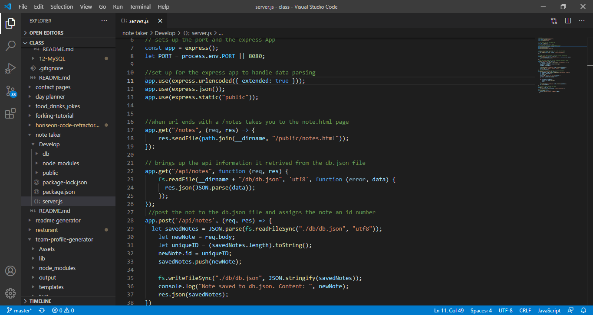
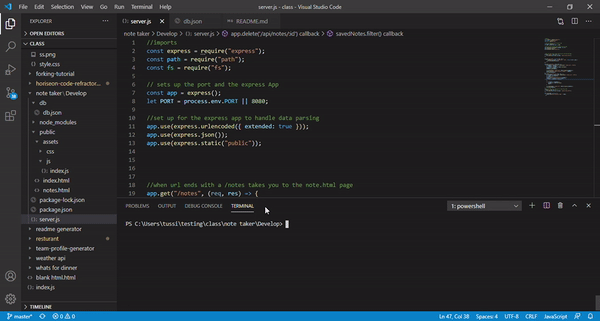

  
  # express-note-taker
 
  ## Description
  This project focuses on the use of express inside of node to create a web-based note taker. With the use of GET, POST, and DELETE you can navigate to the webpages, add the note that you want, and delete notes that are no longer needed.
  
  ## Table of Contents
  - [Title](#Title)
  - [Description](#description)
  - [Table of Contents](#table-of-contents)
  - [Screenshots](#screenshots)
  - [Installation](#installation)
  - [Usage](#usage)
  - [Testing](#testing)
  - [Additional Information](#additional-information)
  - [License](#license)
  - [Contributing](#contributing)
  - [Questions and Feedback](#questions-and-feedback)

  ## Installation
   to use simple clone the repo, Run npm i, Run node server.js, and the port will be link to your localhost:3001
  
  ## deployed
  this project is deployed at: https://intense-reef-85217.herokuapp.com/

  ## Usage
  This project will be used for creating and storing usefull notes.

  ## Technologies Used:
  express and javascript

  ## Code Sample
  With the use of app.get you can retieve the html file need for the page
  

  ## Screenshots
  

  ## License
  MIT License - see the [LICENSE.txt](https://github.com/tussingj89/express-note-taker/blob/main/LICENSE.txt) file for details
  
  ## Testing 
  There are no current test availible for this project.

  ## Contributing
  When contributing to this repository, please first discuss the change you wish to make via issue, email, or any other method with the owners of this repository before making a change.
  
  ## Questions and Feedback
  Please contact me using one of the following:
  - Github: [tussingj89](https://gist.github.com/tussingj89)

  - Email: tussing40@gmail.com
